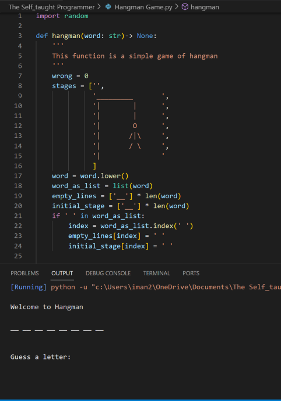

# Hangman Game Project

## Overview

This Hangman Game project, completed in January 2023, is a classic implementation of the popular word-guessing game. I developed it using Python, applying fundamental programming concepts such as lists, loops, and conditional statements.

## Features

- **Interactive Text-Based Interface:** The game features a user-friendly text-based interface that engages players in the word-guessing challenge.
- **Player Input Validation:** Robust input validation ensures that player guesses are accurate and within the game's rules.
- **Random Word Selection:** The game selects words randomly from a predefined list of 42 words, ensuring each playthrough is unique.
- **Graphical Hangman Figure:** To enhance the gaming experience, I implemented a graphical hangman figure that evolves as players make incorrect guesses.

## Credits

This project draws inspiration from Cory Althoff, the author of "The Self-taught Programmer." To see Cory Althoff's version of the Hangman game, you can visit his project [here](http://tinyurl.com/h9q2cpc).

## How to Play

1. Clone or download the project repository to your local machine.
2. Ensure you have Python installed.
3. Run the Hangman game script using your preferred Python interpreter.
4. Follow the on-screen instructions to play the game and guess the hidden word.

Have fun and enjoy playing Hangman!
